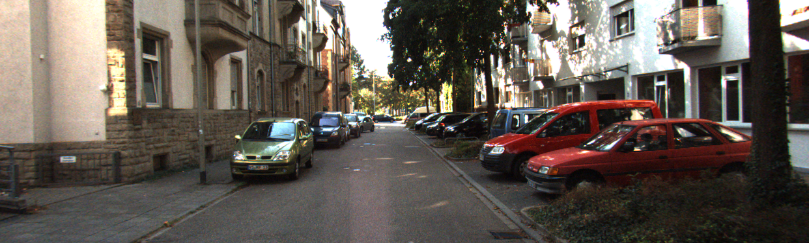
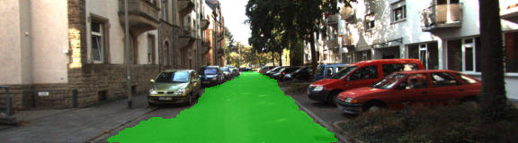

# Drivable Area Segmentation

## Members
- Akash Ram
- Rajesh Kumar
- Aaishu Agarwal
- Md. Riyan Alam


## Abstract

This project deals with the semantic segmentation of a road image using Fully Convolutional Networks(FCN). This project is an example of the technology used by self driving cars. The area of the road through which the self driving car can traverse is highlighted. We use KITTI dataset and a VGG16 pre-trained model to train our own model to produce prediction.  
## Dataset

We are going to use the KITTI road dataset. Which can be downloaded from the given link: [Download Dataset](https://s3.eu-central-1.amazonaws.com/avg-kitti/data_road.zip)
- Extract the zip file and place it in "./data/ " directory.
- This will create a folder "data_road"

## Pretrained Model
You can download the Pretrained VGG model from [here](https://s3-us-west-1.amazonaws.com/udacity-selfdrivingcar/vgg.zip) 
- Extract the .zip file and paste it in "./data/"
- Alternatively there is code provided in helper.py to download the vgg model and save it in the desired location.


  
## Usage

First run the following command:

```bash
  python main.py -h
```
This will show the list of commands one can use to change the parameters. 
To run the model on default parameters you can use the following code 

```bash
  python main.py -i './data/data_road/training/image_2/*.png' -l './data/data_road/training/gt_image_2/*_road_*.png' -e 20 -n 2
```
## Output
The raw images from the "./data/data_road/testing/image_2" will be segmented and will be saved in "./runs/{}"

An example of the original and segmented image is shown below:
 

 
 
  Link to the Google Colaboratory notebook where the completed code is executed is given here: [Colab](https://colab.research.google.com/drive/1BJc_kq5Q4mCR4Bf9XxFxtOPoeEN4vHKh?usp=sharing)
